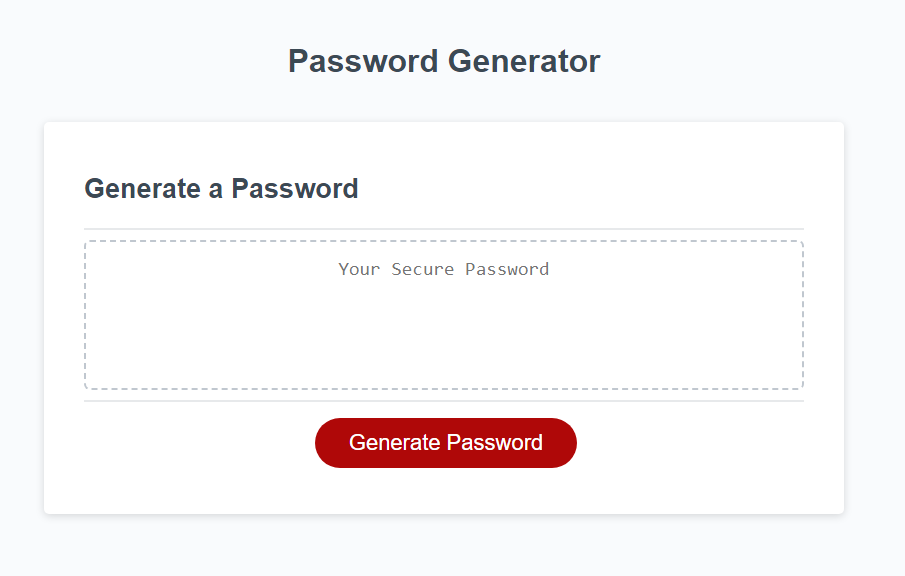
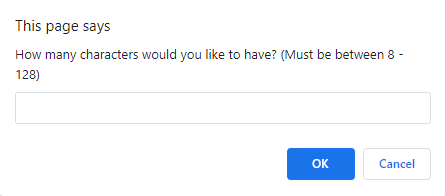
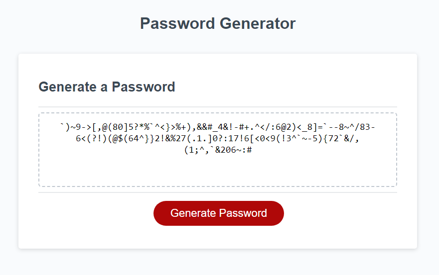
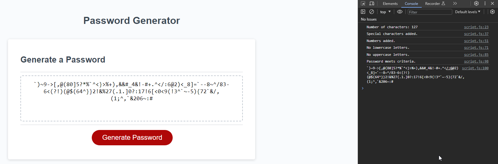
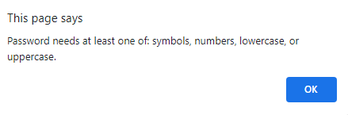

# Challenge-3

## Description
Challenge 3 coursework for UT bootcamp.
I am to create a password generator for this challenge,
in which the password must meet the criteria of:
-Having 8 - 128 characters in length.
-Having AT LEAST one of: symbols, numbers, lowercase, or uppercase letters. 
Comments are added through the script.js file for readability.

## Screenshots
--The screen as seen (I did not design, it came with the .html)--

--Asks user how many characters they would like--

--Asks user if they would like symbols--

--Asks user if they would like numbers--

--Asks user if they would like lowercase letters--

--Asks user if they would like uppercase letters--

--Generates the password--
(This was based on 127 characters, OK to symbols, OK to numbers only)

--The generated password with the console log opened on side--

--If the user does not want to input the correct number of characters, or any number at all--

--If user clicks "Cancel" on every confirm about symbols, numbers, lowercase letters, and uppercase letters--

## Usage
Simply click on the link and watch the magic happen. 
Link to the website: [https://alliestewart.github.io/Password-Generator](https://alliestewart.github.io/Password-Generator/)

## What I Have Learned
I have learned how versatile JavaScript can be with this password generator project.
Utilizing alerts, confirms, and prompts were a must, as well as 
if/else statements in order to allow the user to make choices for their password,
but under a couple guidelines.

## Credits
Made by Allie Stewart.
Google helped a ton for alert/confirm/prompt, 
but so did class notes in regards to if/else usage.

## Licenses
Please refer to the LICENSE in the repository.
